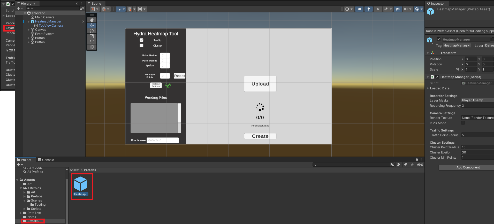
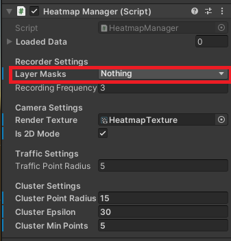
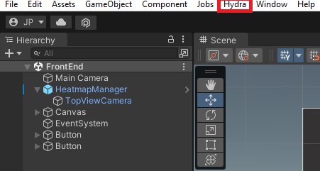
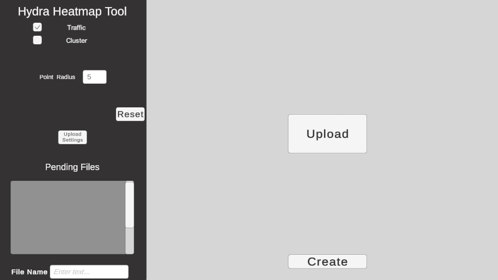

# Hydra-Heatmap-For-Unity

## FEATURES
- Layer based heatmap tracking
- Event based heatmap tracking
- JSON saving backend with front end creation tool

## INSTALLAION
- Navigate to the [Releases](https://github.com/Oxyjon/Hydra-Heatmap-For-Unity/releases/tag/V1.0) tab in this repository and import the package file

## HOW TO

**BACKEND (IN ENGINE)**  

First, Add the `HeatmapManager` Prefab to your scene which is located in the Prefabs Folder.  

 

The Heatmap can record data two seperate ways which is a layer based format and an event based format. When the `HeatMapManager` is configured and in scene, on startup a settings file will be generated and on exit everything that you have listed to recorded will be saved into JSON files. It will save individual objects as well as everything total on the layer. These files are used for the front end tool to create the heatmap to which you can configure and generate based on what files you upload to the application:  
 
**THESE FILES ARE SAVED IN "C://USERS/DOCUMENTS/HYDRA/"**  

**LAYER:**  

  

In the editor view you can preset the layers on which you would like to save. There are a few things that are location in the **Recorder Settings** that will need to be configured when using this option:  

- **Is2DMode - True/False whether the application is a 2D or 3D game**
- **LayerMasks - The layers of which objects you'd like to save**
- **Recording Frequency - How often you would like to save runtime data**

The `HeatmapManager` prefab has a child camera attached which is used for an overhead view to mark points and convert into points. To configure this camera there will be a new tab in the toolbar listed as `Hydra` which will give you a camera view. From here you will be able to see what that camera is viewing. You need need to change the orthographic size and fit in frame. All of these values will be recorded for the front end application.  

 

The system doesn't track options that are added and removed at runtime. There is a helper function in the HeatmapManager that you will need to call:  

**EXAMPLE**  
- **ADDING OBJECTS FUNCTION**  
```csharp
		public void AddRuntimeObjectToTrack(GameObject _obj)
		{
			//get layer from object and add to the matching layer
			LayerMask layerMask = 1 << _obj.layer;
			if(layerMasks == (layerMasks | layerMask))
			{
				layerData[layerMask].AddObject(_obj);
			}
		}
```
- **ADDING OBJECTS EXAMPLE**  
The function needs to be called after being instantiated.  
```csharp
        private void Shoot()
		{
			Bullet bullet = Instantiate(bulletPrefab, transform.position, transform.rotation);
			HeatmapManager.Instance.AddRuntimeObjectToTrack(bullet.gameObject);	
		}
```
- **REMOVING OBJECTS**  
```csharp
		public void LogDestroyedObject(GameObject obj)
		{
			foreach(KeyValuePair<LayerMask, LayerData> layer in layerData)
			{
				if(layer.Value.Contains(obj))
				{
					layer.Value.AddObjectToDestroyedDictionary(obj);
				}
			}

			Destroy(obj);
		}
```
- **REMOVING OBJECTS EXAMPLE**  
The functions needs to be called before being destroyed.  
```csharp
		private void OnCollisionEnter2D(Collision2D col)
		{
			HeatmapManager.Instance.LogDestroyedObject(gameObject);
			Destroy(gameObject);
		}
```

**EVENT:**  
Any event you would like to record called be recorded with called Log function. The function requires a position and an event name.  
**EXAMPLE**  
- **LOG EVENT**  
```csharp
		public void AddHeatmapEvent(string eventName, Vector3 position)
		{
			if(eventPositions == null)
				eventPositions = new Dictionary<string, List<Vector3>>();

			if(!eventPositions.ContainsKey(eventName))
			{
				eventPositions[eventName] = new List<Vector3>();
			}

			eventPositions[eventName].Add(position);
		}
```
- **LOG EVENT EXAMPLE**  
```csharp
		private void Shoot()
		{
			Bullet bullet = Instantiate(bulletPrefab, transform.position, transform.rotation);
			HeatmapManager.Instance.AddRuntimeObjectToTrack(bullet.gameObject);
			bullet.Fire(transform.up);
			HeatmapManager.Instance.AddHeatmapEvent("Player Shoot", transform.position);
			
		}
```

**FRONT-END**  

 
The front-end tool is a supplied application in where you can use the generated json files.
The tool is able to create `Traffic` or `Cluster` Heatmaps. With each mode you are able to change some configuration settings to make the heatmap to your requirements.

You will need to upload the `settings.json` which is created at the time of each recording session.  

Upon clicking the `Create` button, if all the data has been populated corrected and there are no error prompts you will then be given a progress counter to show you how many points are remaining to be processed. At the end of the creation the heatmap will be saved as a .png in the follow location:

**THESE FILES ARE SAVED IN "C://USERS/DOCUMENTS/HYDRA/"**