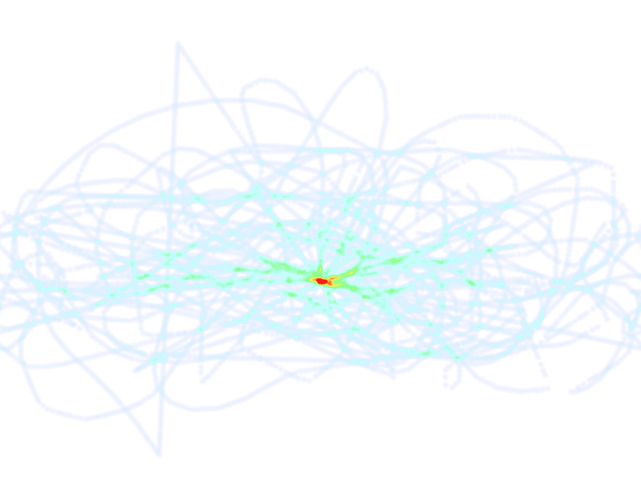
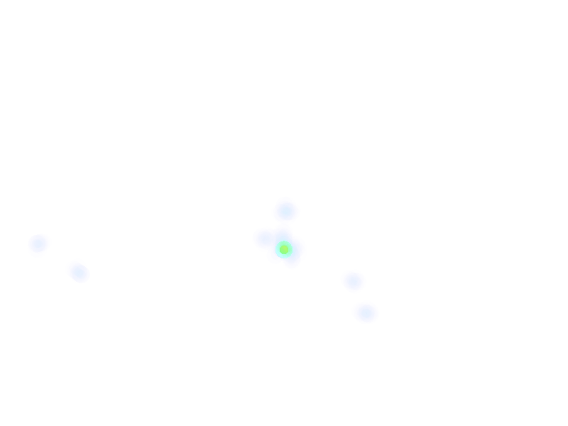
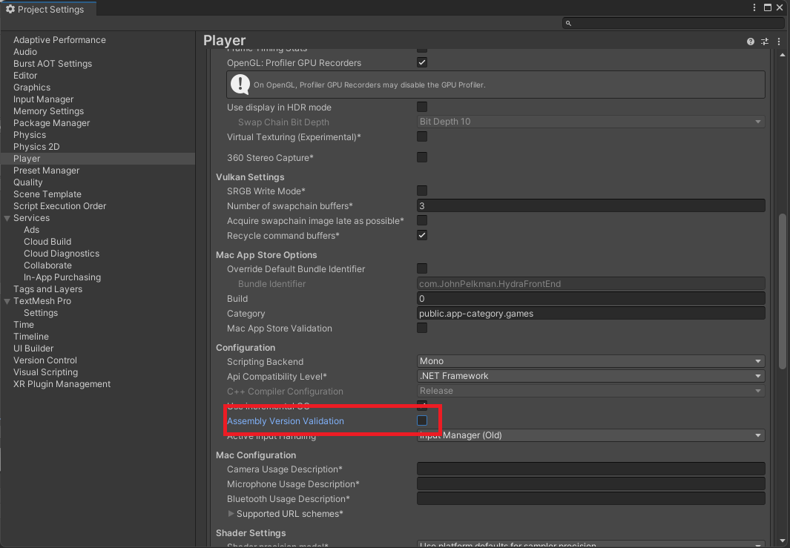
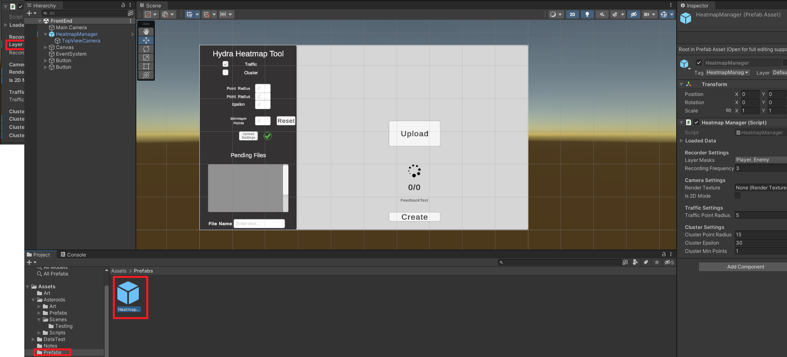
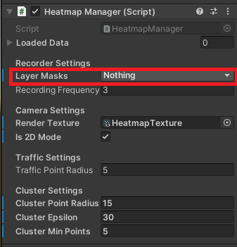
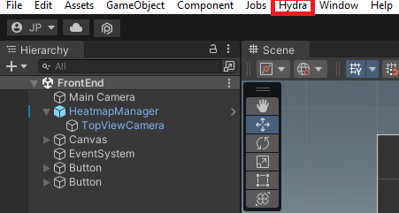
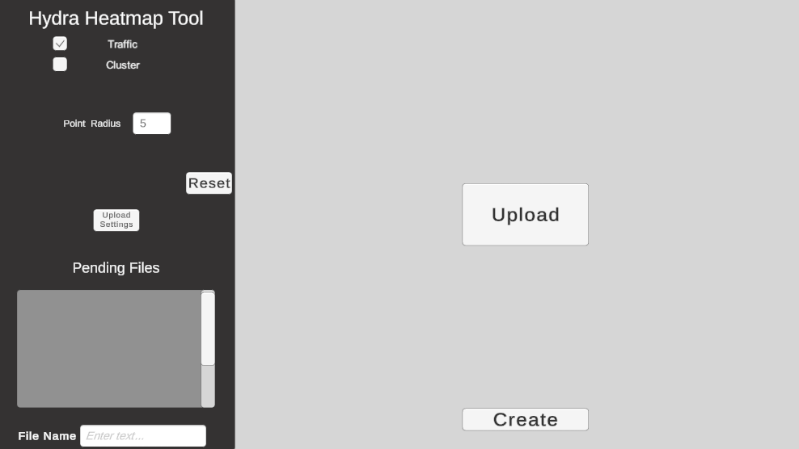

<h1 align="center">🔥 2D Heatmap For Unity</h1>

<p align="center">
  A lightweight analytics tool for Unity that records gameplay data at runtime and turns it into <b>Traffic</b> and <b>Cluster</b> heatmap images.
</p>

<p align="center">
  
  
  <a href="https://github.com/Oxyjon/2D-Heatmap-For-Unity/releases"></a>
</p>

---

## 📸 Examples

| Traffic Heatmap | Cluster Heatmap |
| :---: | :---: |
|  |  |
| Shows how frequently areas are visited over time. | Groups nearby points into clusters using DBSCAN. |

---

## 📑 Table of Contents

- [Features](#-features)
- [Installation](#-installation)
- [Quick Start](#-quick-start)
- [Recording Data](#-recording-data)
  - [Layer-Based Recording](#layer-based-recording)
  - [Tracking Runtime Objects](#tracking-runtime-objects)
  - [Event-Based Recording](#event-based-recording)
  - [Saving the Data](#saving-the-data)
- [Creating Heatmaps (Front-End Tool)](#-creating-heatmaps-front-end-tool)
- [Output Location](#-output-location)
- [API Reference](#-api-reference)

---

## ✨ Features

- 🗂️ **Layer-based tracking** – automatically record the positions of every object on chosen layers.
- 🎯 **Event-based tracking** – log custom gameplay events (shots, deaths, pickups…) at any position.
- 🌡️ **Two heatmap types** – generate **Traffic** or **Cluster** heatmaps as `.png` images.
- 💾 **JSON backend** – all session data is saved to JSON for later processing.
- 🖥️ **Front-end creation tool** – load recorded files, tweak settings and generate heatmaps without touching code.
- 🎥 **Editor camera window** – preview and frame the overhead heatmap camera directly in the editor.
- 🧭 **2D & 3D support** – works with both 2D and 3D projects.

---

## 📦 Installation

1. Head to the [**Releases**](https://github.com/Oxyjon/2D-Heatmap-For-Unity/releases/tag/V1.1) page.
2. Download the `.unitypackage` and import it into your project (**Assets → Import Package → Custom Package…**).

> [!WARNING]
> After importing you may see an error related to **Plastic SCM**. To fix it, either **restart the project** or disable **Assembly Version Validation** in **Project Settings → Player**.
>
> 

---

## 🚀 Quick Start

1. Drag the `HeatmapManager` prefab (found in the `Prefabs/Manager` folder) into your scene.
2. Configure the **Recorder Settings** in the Inspector.
3. Frame the heatmap camera using **Hydra → HeatmapCamera** in the toolbar.
4. Play your game – data is recorded automatically.
5. Call `HeatmapManager.Instance.LogAllData()` to save the session.
6. Open the **FrontEnd** scene, load your files and click **Create**.



---

## 🎮 Recording Data

When the `HeatmapManager` is in a scene, a **settings file** is generated on startup. When the session is logged, everything being tracked is saved to JSON – both **per-object** data and **combined per-layer** data. These files are then used by the front-end tool to build your heatmaps.

### Layer-Based Recording



Configure the following on the `HeatmapManager` in the Inspector:

| Setting | Description |
| --- | --- |
| **Layer Masks** | The layers whose objects will be recorded. |
| **Recording Frequency** | How often (in seconds) positions are sampled. |
| **Is 2D Mode** | Whether your game is 2D or 3D. |

#### Configuring the Heatmap Camera

The `HeatmapManager` prefab includes a child **overhead camera** that is used to convert world positions into heatmap pixels.

Open **Hydra → HeatmapCamera** from the toolbar to preview what the camera sees, then adjust its position and **orthographic size** until your level fits in frame. These values are saved with the session and used by the front-end tool.



### Tracking Runtime Objects

Objects that are **instantiated or destroyed at runtime** are not tracked automatically. Use the helper methods below.

**Adding an object** – call *after* instantiating:

```csharp
private void Shoot()
{
    Bullet bullet = Instantiate(bulletPrefab, transform.position, transform.rotation);
    HeatmapManager.Instance.AddRuntimeObjectToTrack(bullet.gameObject);
}
```

**Removing an object** – call *before* destroying:

```csharp
private void OnCollisionEnter2D(Collision2D col)
{
    HeatmapManager.Instance.LogDestroyedObject(gameObject);
}
```

> [!NOTE]
> `LogDestroyedObject` destroys the GameObject for you, so a separate `Destroy()` call isn't needed.

### Event-Based Recording

Any gameplay event can be recorded by passing an **event name** and a **position**:

```csharp
private void Shoot()
{
    Bullet bullet = Instantiate(bulletPrefab, transform.position, transform.rotation);
    HeatmapManager.Instance.AddRuntimeObjectToTrack(bullet.gameObject);
    bullet.Fire(transform.up);

    HeatmapManager.Instance.AddHeatmapEvent("Player Shoot", transform.position);
}
```

### Saving the Data

To write all recorded data to disk, call `LogAllData()` – for example when the player retries or the level ends:

```csharp
public void Retry()
{
    HeatmapManager.Instance.LogAllData();
    SceneManager.LoadScene(SceneManager.GetActiveScene().buildIndex);
}
```

---

## 🖥️ Creating Heatmaps (Front-End Tool)



The front-end tool (the `FrontEnd` scene) turns your recorded JSON files into heatmap images.

1. **Upload the settings file** – select the `settings.json` created for the recording session.
2. **Upload data files** – select one or more recorded JSON data files.
3. **Choose a heatmap type** and adjust its settings:

   | Mode | Settings | Description |
   | --- | --- | --- |
   | **Traffic** | Point Radius | Size of each drawn point. |
   | **Cluster** | Point Radius, Epsilon, Min Points | Max distance between points and the minimum number of points required to form a cluster (DBSCAN). |

4. **Enter a file name** and click **Create**.

If everything is valid, a progress counter will show how many points remain. Once complete, the heatmap is saved as a `.png`.

---

## 📁 Output Location

All data and generated heatmaps are saved to your **Documents** folder:

```
Documents/Hydra/HeatmapData/<SceneName>/<Timestamp>/
├── Combined/            # Combined data per layer / event
├── DataFiles/           # Individual object & event data
├── <LayerName>/         # Runtime layer heatmaps
└── LoadedDataHeatMap/   # Heatmaps created in the front-end tool
```

---

## 📚 API Reference

All methods are accessed through the `HeatmapManager.Instance` singleton.

| Method | Description |
| --- | --- |
| `AddRuntimeObjectToTrack(GameObject obj)` | Starts tracking an object spawned at runtime (if it's on a tracked layer). |
| `LogDestroyedObject(GameObject obj)` | Records an object's destruction and destroys it. |
| `AddHeatmapEvent(string eventName, Vector3 position)` | Logs a named event at a world position. |
| `LogAllData()` | Stops recording and saves all session data to disk. |